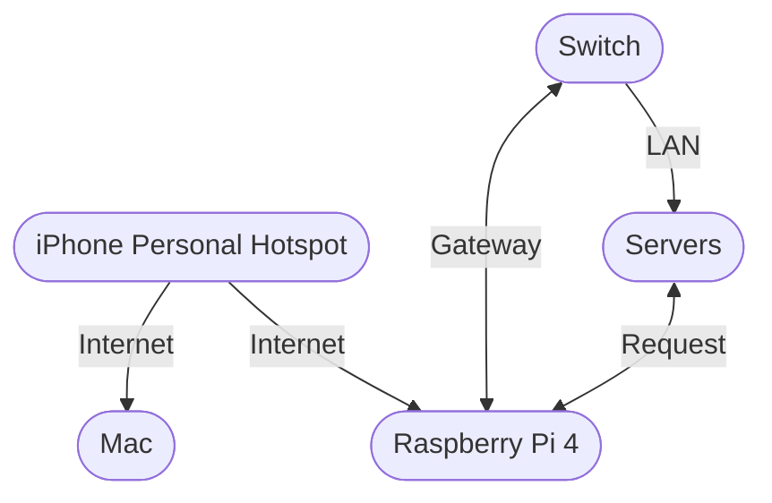
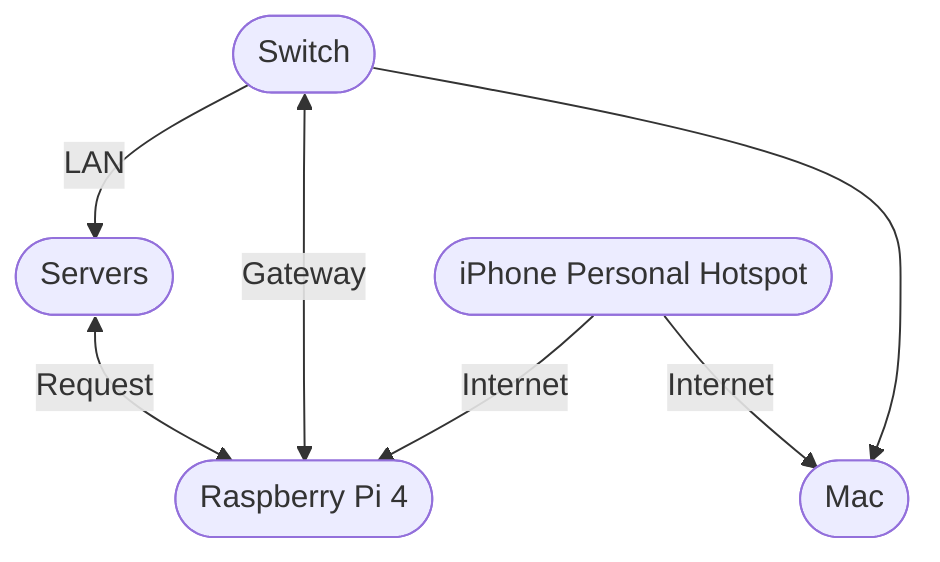
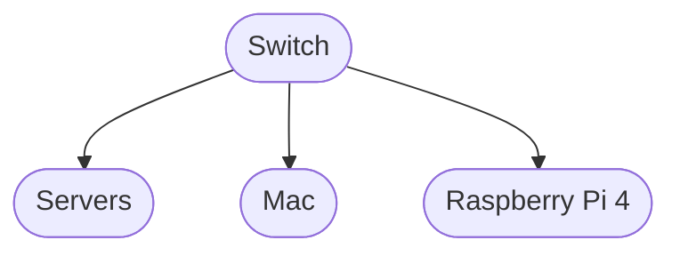
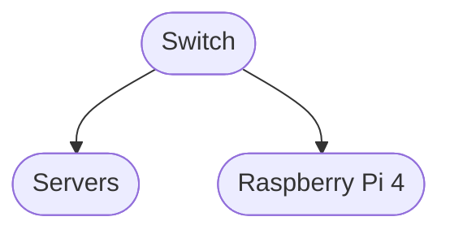

# My Raspberry Pi Server Network

Currently, I have just two Raspberry Pi servers. However, this network setup is theoretically capable of supporting hundreds of servers—well, technically up to 254. So, why limit it by labeling it a  _"2-Pi server network"_? Such a modest name wouldn’t do justice to its potential. Moreover, it feels somewhat absurd to keep an entire router powered 24/7 merely to access two tiny devices. To put it bluntly, it’s ridiculous.

To add insult to injury, this router consumes around  _5.04–12.10 kWh per week_  (_typical consumption_: approximately  _7.56 kWh_), costing anywhere between  _₹32.76 and ₹96.20 per week_  (_typical cost_:  _₹49.14–₹60.09_)—just for the privilege of maintaining connectivity with two small computers. Therefore, I’ve decided simply to call this  _my server network_, which serves as a gentle reminder of its scalability and potential size rather than its wastage of electricity.

### Setting It All Up

When configuring my servers, I ran into a particular challenge. Before diving into that, let me clearly outline what I wanted to achieve:

-   **Remote Access:**  Access both Raspberry Pis via SSH and VNC.
    
-   **Internet Connectivity:**  Ensure the servers maintain internet access whenever my personal hotspot (via my iPhone) is available. This allows scheduled tasks, such as regular backups, to run smoothly. For instance, I have scheduled bi-weekly backups of my current project—the Sienna repository and its branches—to maintain reliable data backups.
    

The issue arose because my MacBook has only one Wi-Fi adapter, meaning it can connect to only one Wi-Fi network at a time. This limitation is not Apple's fault though—I don't think more than 5% of laptops worldwide come with multiple built-in Wi-Fi adapters.

A straightforward solution might be to air-gap the Pis by keeping them isolated, but that would eliminate internet access entirely—clearly not ideal. After considerable experimentation (and several enlightening conversations with GPT), I developed a more elegant solution.

### My Solution Explained

Initially, I considered connecting my Wi-Fi router directly to my iPhone’s hotspot and then distributing internet access to the entire LAN. Unfortunately, this didn’t work because my router (like most consumer-grade routers) can't source its WAN connection from a Wi-Fi or LAN client; it insists on using a dedicated WAN port.

However, I realized I could utilize a built-in router setting: the default gateway, often referred to simply as the "router address." Typically, routers set themselves as the default gateway, instructing all devices on the LAN to route traffic through them. But it turns out you can override this gateway to point elsewhere—in my case, to a Raspberry Pi.

I chose my Raspberry Pi 4 for this task because routing introduces some overhead. My Pi is now configured to automatically connect to my iPhone's hotspot whenever it’s available. It acts as the network gateway, receiving internet requests via Ethernet, forwarding them via Wi-Fi to my hotspot, and returning responses back to the clients on the LAN. This essentially turns my Pi into the network’s primary router and internet handler—without needing additional hardware or incurring further costs.

### Flexibility of this Setup:

My Mac can either connect directly to my iPhone's hotspot or join the server network via Ethernet/Wi-Fi. Thanks to the independence of internet and LAN connectivity, I retain full access to the servers even if internet service is down.

Below are diagrams clearly representing the different operational modes of my setup:

----------

**Mode 1 — Idle Mode**

_Scheduled tasks running on servers; Mac disconnected from LAN._

----------

**Mode 2 — Access Mode**

_Mac connected to the server LAN; internet available via Raspberry Pi._

----------

**Mode 3 — Offline LAN**

_Mac connected to server LAN; no internet access._

----------

**Mode 4 — Autonomous Mode**

_Fully offline autonomous scheduled tasks (when I’m away)._

----------

**An Elegant Touch: Handling Internet Outages**

To add a professional touch, my Pi behaves exactly like modern ISP routers. If my hotspot is unavailable, instead of quietly dropping packets and making clients wait, it immediately replies with an ICMP Destination Unreachable message. This way, all devices instantly know when the internet is offline, providing a smooth, responsive user experience typical of professional-grade networks.

**Will I Ever Use These Servers?**

Probably never. But hey, it sounds darn cool to casually mention that I maintain a custom, self-hosted, dynamically routed server network with intelligent failover. Plus, since my hostel covers the electricity bill, it's essentially free bragging rights—efficiency be damned!
