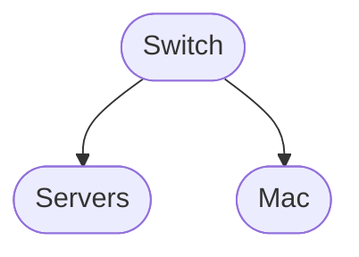

# My Raspberry Pi Server Network

Currently, I have just two Raspberry Pi servers. But this network setup is theoretically capable of supporting hundreds of servers—well, technically up to 254. So, why limit it by labeling it a  _“2-Pi server network”_? Such a modest name doesn’t do justice to its potential. Moreover, it feels somewhat absurd to keep an entire router powered 24/7 merely to access two tiny devices. To put it bluntly, it’s ridiculous.

To add insult to injury, this router consumes around  _5.04–12.10 kWh per week_  (_typical consumption_: approximately  _7.56 kWh_), costing anywhere between  _₹32.76 and ₹96.20 per week_  (_typical cost_: _₹49.14–₹60.09_)—just for the privilege of maintaining connectivity with two small computers. Therefore, I’ve decided simply to call this  _my server network_, which serves as a gentle reminder of its scalability and potential size, not wastage of electricity.

### Setting It All Up

When configuring my servers, I ran into a particular challenge. Before diving into that, let me outline clearly what I wanted to achieve:

- **Remote Access:**  Access both Raspberry Pis via SSH and/or VNC.

- **Internet Connectivity:**  Ensure that the servers maintain internet access whenever my personal hotspot (via my iPhone) is available. This allows scheduled tasks, such as regular backups, to run smoothly. For instance, I have scheduled bi-weekly backups of my current project—the Sienna repository and its branches—to maintain data backups.

The issue arose because my MacBook has only one Wi-Fi adapter, meaning I can connect to just one Wi-Fi network at a time. This limitation is not Apple's fault though; I don't think any laptop that more than 5% of world uses have more than one built-in Wi-Fi adapter.

A straightforward solution is to air-gap the Pis by keeping them isolated, but that would eliminate internet access. Clearly, not ideal. Instead, here’s my solution that meets all my requirements and even gracefully handles scenarios when my iPhone hotspot isn’t available.

### My Solution Explained

At the heart of this solution is a switch—specifically, a router so with Wi-Fi capability. Here’s how it works:

-  **Local Network (LAN):**  All Raspberry Pis connect to the switch via Ethernet, forming a stable LAN.

- **Internet Access:**  The switch automatically connects to my iPhone’s hotspot whenever it’s available, distributing internet access across the entire LAN.

-  **Flexibility:**  My Mac can directly use the iPhone’s internet or connect via Ethernet/Wi-Fi to the switch, accessing both internet and servers through the same infrastructure. Additionally, since internet and server connections are independent, I can access the servers even if the internet is down.

Below are diagrams representing different operational modes:

**Mode 1 — Idle Mode**

**Scheduled tasks running on servers; Mac disconnected from LAN**

----------

**Mode 2 — Access Mode**

**Mac connected to the server LAN; internet available via switch**

----------

**Mode 3 — Offline LAN**

**Mac connected to server LAN; no internet access**

----------

**Mode 4 — Autonomous Mode**

  

**Fully offline and autonomous scheduled tasks (when I’m away)**

----------

**Will I Ever Use These Servers?**

Probably never. But hey, it sounds impressive to casually mention that I maintain a custom, self-hosted server network. Plus, my hostel covers the electricity bill anyway, so it’s essentially free bragging rights—efficiency be damned!
